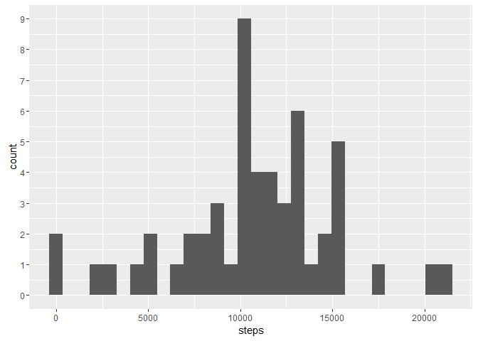
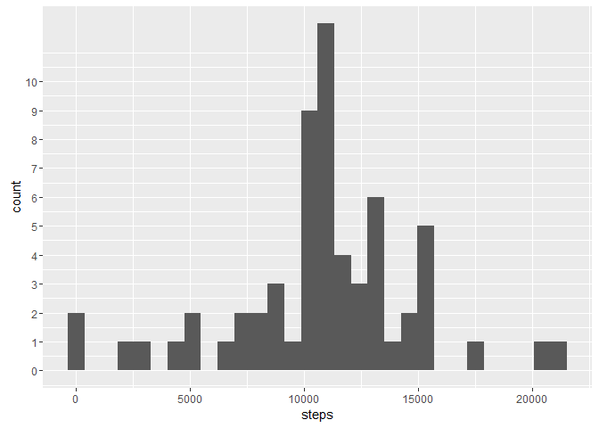
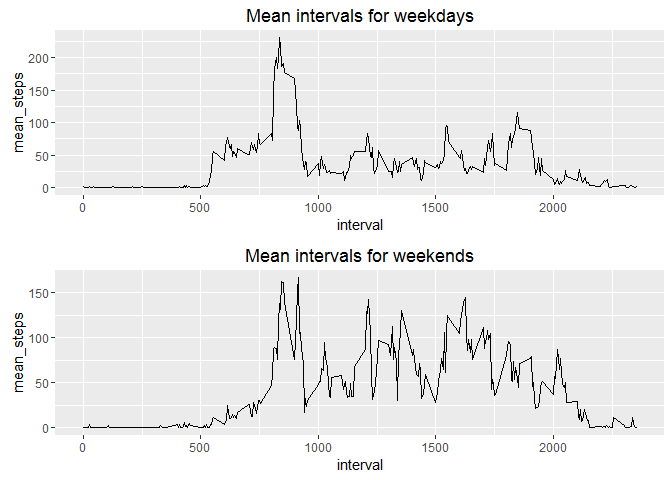

# Reproducible Research: Peer Assessment 1

## Loading the data


```r
require(dplyr)
```

```
## Loading required package: dplyr
```

```
## Warning: package 'dplyr' was built under R version 3.3.2
```

```
## 
## Attaching package: 'dplyr'
```

```
## The following objects are masked from 'package:stats':
## 
##     filter, lag
```

```
## The following objects are masked from 'package:base':
## 
##     intersect, setdiff, setequal, union
```

```r
require(ggplot2)
```

```
## Loading required package: ggplot2
```

```r
activity <- read.csv("activity.csv")
```

## What is mean total number of steps taken per day?

Grouping the dataset by date, calculating the total steps per day and making a histogram of this variable.

```r
by_days <- group_by(activity, date)
total_steps_per_day <- summarise(by_days, steps = sum(steps, na.rm = F))
qplot(steps, data = total_steps_per_day, geom = "histogram") + scale_y_continuous(breaks=seq(0,10,1))
```

```
## `stat_bin()` using `bins = 30`. Pick better value with `binwidth`.
```

```
## Warning: Removed 8 rows containing non-finite values (stat_bin).
```

<!-- -->

Calculating the mean of total steps per day.

```r
mean(total_steps_per_day$steps, na.rm = T)
```

```
## [1] 10766.19
```

Calculating the median of total steps per day.

```r
median(total_steps_per_day$steps, na.rm = T)
```

```
## [1] 10765
```

## What is the average daily activity pattern?


Calculating the number of steps averaged across all days for each interval. 

```r
intervals <- group_by(activity, interval)
mean_intervals <- summarise(intervals, mean_steps = mean(steps, na.rm = T))
qplot(x = interval, y = mean_steps, data = mean_intervals, geom = "line")
```

<!-- -->

Calculating the interval, averaged across all days, which contains the maximum number of steps.

```r
mean_intervals$interval[which.max(mean_intervals$mean_steps)]
```

```
## [1] 835
```

## Imputing missing values

Calculating the total number of missing values.

```r
table(is.na(activity$steps))
```

```
## 
## FALSE  TRUE 
## 15264  2304
```

Filling the missing values with the 5-minute interval means for the corresponding interval.

```r
filled_activity <- activity

for (i in 1:nrow(filled_activity)) {
        if (is.na(filled_activity$steps[i])) filled_activity$steps[i] <- mean_intervals$mean_steps[which(mean_intervals$interval==filled_activity$interval[i])]
}
```

Calculating total steps per day from the filled dataset and then creating a histogram.

```r
filled_by_days <- group_by(filled_activity, date)
filled_total_steps_per_day <- summarise(filled_by_days, steps = sum(steps))
qplot(steps, data = filled_total_steps_per_day, geom = "histogram") + scale_y_continuous(breaks=seq(0,10,1))
```

```
## `stat_bin()` using `bins = 30`. Pick better value with `binwidth`.
```

<!-- -->

Calculating the mean of total steps per day from the filled dataset.

```r
mean(filled_total_steps_per_day$steps)
```

```
## [1] 10766.19
```
This is the same value (at least for the current 7-digit precision) as for the original dataset.

Calculating the median of total steps per day from the filled dataset.

```r
median(filled_total_steps_per_day$steps)
```

```
## [1] 10766.19
```
This value differs from the one from the original dataset. It should be mentioned that this is the same value as the mean of total steps per day from the filled dataset. Therefore, the impact of imputing missing values on the estimates of total daily number of steps using the strategy that was used in this analysis is very minor.


## Are there differences in activity patterns between weekdays and weekends?

Adding a factor column with indication if the day belongs to a weekday or a weekend to the filled dataset.

```r
filled_activity$is_weekend <- (weekdays(as.POSIXlt(filled_activity$date))=="Saturday" | weekdays(as.POSIXlt(filled_activity$date))=="Sunday")
filled_activity$is_weekend <- as.factor(filled_activity$is_weekend)
levels(filled_activity$is_weekend) <- c("weekday", "weekend")
```

Calculating mean steps for each interval averaged by all days for both subsets: weekdays and weekends.

```r
filled_mean_intervals_weekdays <- filter(filled_activity, is_weekend=="weekday") %>% group_by(interval) %>% summarise(mean_steps = mean(steps))
filled_mean_intervals_weekends <- filter(filled_activity, is_weekend=="weekend") %>% group_by(interval) %>% summarise(mean_steps = mean(steps))
```

Loading a script for panel plots in ggplot2 called multiplot from [R-Cookbook](http://www.cookbook-r.com/Graphs/Multiple_graphs_on_one_page_%28ggplot2%29/) and then using it to make both plots.

```r
source("http://peterhaschke.com/Code/multiplot.R")
p1 <-  ggplot(filled_mean_intervals_weekdays, aes(x=interval, y=mean_steps)) + geom_line() + ggtitle("Mean intervals for weekdays")
p2 <-  ggplot(filled_mean_intervals_weekends, aes(x=interval, y=mean_steps)) + geom_line() + ggtitle("Mean intervals for weekends")
multiplot(p1, p2)
```

```
## Loading required package: grid
```

<!-- -->

